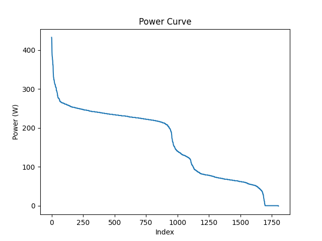

# Leistungskurve_ma_lu
Dieses Projekt liest Leistungsdaten aus einer CSV-Datei ein, sortiert die Werte mit einem eigenen Bubble-Sort-Algorithmus und erstellt eine Power-Curve-Grafik.

#Vorraussetzungen
Python 3.X
PDM

# Projekt-Abhängigkeiten installieren
1. bash, um ein Terminal zu öffnen
2. pdm install 

# Das Programm wird mit folgenden Befehlen ausgeführt
1. bash
2. pdm run python power_curve.py, um Daten auszuwerten und Grafik zu erstellen

#Ergebnis
Die Grafik wird im Ordner "figures" gespeichert.

# Verwendung
Die Datei "activity.csv" muss sich im Projektordner befinden.

Das Programm:
1. lädt die Leistungsdaten aus der CSV-Datei
2. sortiert die Werte mit bubble_sort
3. erstellt eine Leistungskurve
4. zeigt die Grafik mit matplotlib an 

# Beispielabbildung

# Verwendete Bibliotheken
numpy
matplotlib

